<div align="center">
<h1>🔧 Data Engineering Pipeline - TPCH project</h1>

<h3>ELT pipeline built with DBT, Snowflake, Airflow</h3>
</div>

## Table of Contents

| S/NO | Section |
| --- | --- |
| 1. | [About this Project](#1) |
| 2. | [Workflow](#2) |
| 3. | [Prerequisites](#3) |
| 4. | [Setup](#4) |
| 5. | [Teardown](#5) |


## About this Project <a name="1"></a>

This project utilises to DBT, Snowflake and Airflow to build a data pipeline that processes the TPCH benchmark data within a Snowflake data warehouse.

<details open>
  <summary>Repository organisation</summary>

  ```
  .
  ├── Dockerfile
  ├── LICENSE
  ├── Makefile
  ├── README.md
  ├── airflow_settings.yaml
  ├── dags
  │   ├── dbt
  │   │   └── tpch-pipeline
  │   └── dbt_dag.py
  ├── include
  ├── packages.txt
  ├── plugins
  ├── poetry.lock
  ├── pyproject.toml
  ├── requirements.txt
  └── tests
      └── dags
          └── test_dag.py
  ```
</details>

<details open>
  <summary>DBT organisation</summary>
    
  ```
  dags/dbt
  └── tpch-pipeline
      ├── analyses
      ├── dbt_packages
      │   └── dbt_utils
      ├── dbt_project.yml
      ├── logs
      │   └── dbt.log
      ├── macros
      │   └── discounted_amount.sql
      ├── models
      │   ├── intermediate
      │   ├── marts
      │   └── staging
      ├── package-lock.yml
      ├── packages.yml
      ├── profiles.yml
      ├── scripts
      │   ├── setup_dwh.sql
      │   └── teardown_dwh.sql
      ├── seeds
      ├── snapshots
      └── tests
          ├── fct_orders_date_valid.sql
          └── fct_orders_discount.sql
  ```
</details>

## Workflow <a name="2"></a>

Deployment pipeline

```mermaid
flowchart LR
%% Nodes
    A[stg_tpch_line_items]
    B[stg_tpch_orders]
    C[int_order_items]
    D[int_order_items_summary]
    E[fct_orders]

%% Styles
    style A fill: #202020, stroke: #77A3C9
    style B fill: #202020, stroke: #77A3C9
    style C fill: #202020, stroke: #ffaf00
    style D fill: #202020, stroke: #ffaf00
    style E fill: #202020, stroke: #afd700

%% Links
    A --> C
    B --> C
    C --> D
    B --> E
    D --> E
```




## Prerequisites <a name="3"></a>

Before running this pipeline, make sure you have the following prerequisites installed:

- SnowSQL: Snowflake's command-line client for interacting with Snowflake. You can download it from the [Snowflake website](https://docs.snowflake.com/en/user-guide/snowsql.html).

- python `3.10`

Next, create a `.env` file in the root directory with the necessary credentials - this is needed to set up the DBT Snowflake connection. An example of the configuration needed can be found in [dev.example.env](/dev.example.env)

<details>
  <summary>Example config</summary>

  ```
  DBT_SNOWFLAKE_ACCOUNT="fs77924.europe-west4.gcp"
  DBT_SNOWFLAKE_USER="csanry"
  DBT_SNOWFLAKE_PASSWORD="set-password-here"
  DBT_ROLE="dbt_role"
  DBT_WH="dbt_wh"
  DBT_DB="dbt_db"
  DBT_SCHEMA="dbt_schema"
  ```
</details>

### Poetry environment

To setup the poetry environment run

```zsh
make setup-env
```

### DBT connections

To setup the DBT dependencies from scratch and check the DBT-snowflake connector, run.

```zsh
make dbt-checks
```

## Setup <a name="4"></a>

### Setup the Snowflake data warehouse

To set up the data warehouse, run the following `snowsql` command

```zsh
snowsql -f $(PWD)/dags/dbt/tpch-pipeline/scripts/setup_dwh.sql
```

### Setup an Airflow instance 

Orchestration is implemented using [Astronomer Cosmos](https://www.astronomer.io/cosmos/); launching a local instance can be done via the following ways

Run the following command using `docker`

```zsh
docker login
astro dev start
```

Using `colima`, allocate a basic runtime instance before running the setup commands

```zsh
colima start --cpu 4 --memory 8
```

This spins up an instance of a local Airflow server at `localhost:8080` for development and testing purposes

## Teardown <a name="5"></a>

### Teardown the Airflow instance

```zsh
astro dev stop
```

Stop colima runtime if necessary using

```zsh
colima stop
```

### Teardown the Snowflake data warehouse

The following command deletes all created user warehouses, databases, schemas, and user roles

```zsh
snowsql -f $(PWD)/dags/dbt/tpch-pipeline/scripts/teardown_dwh.sql
```
